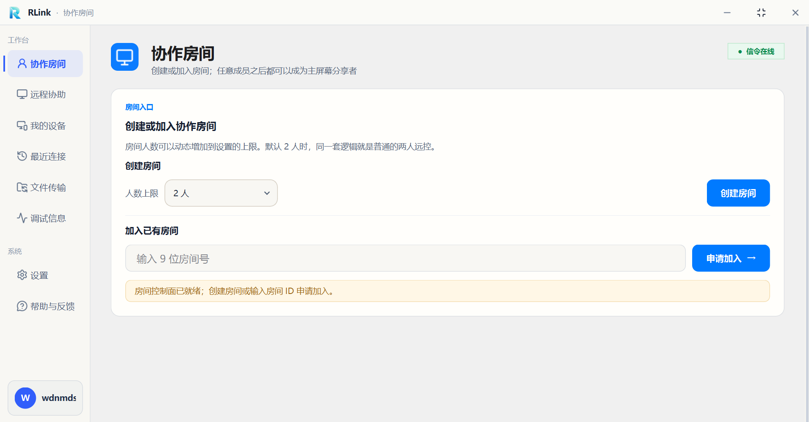
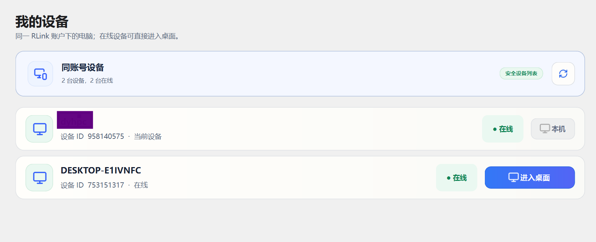
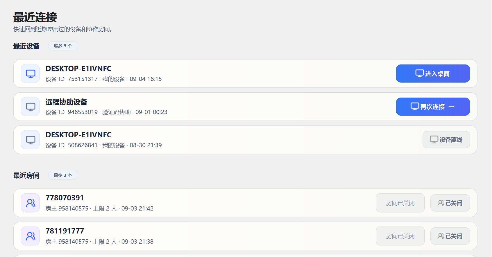
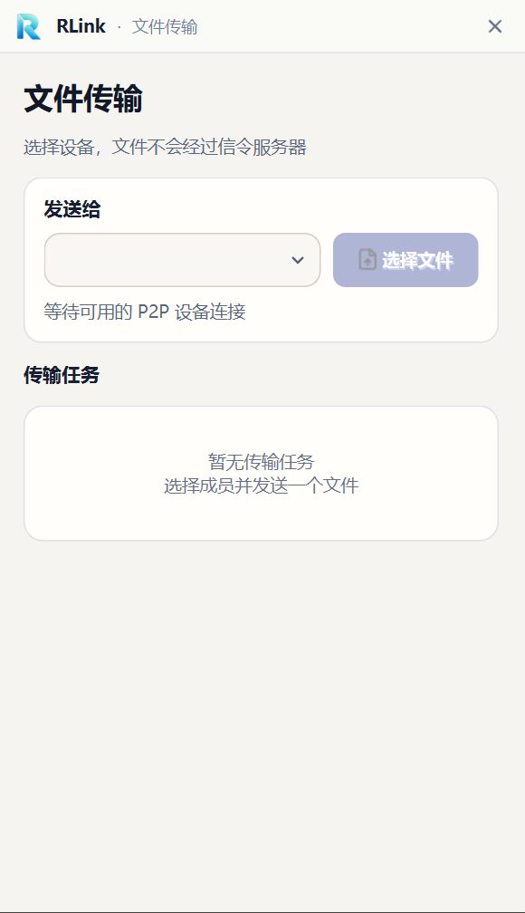
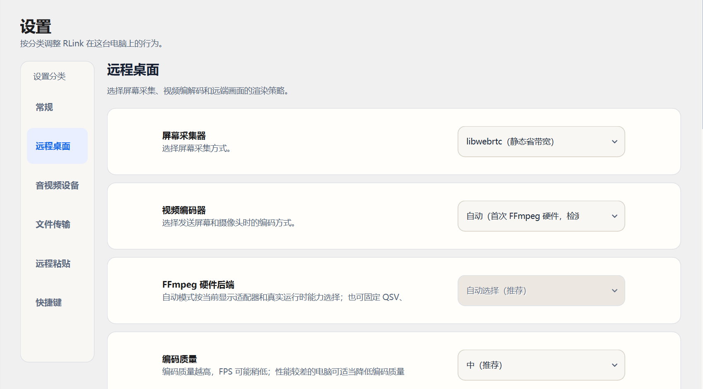

# RLink

RLink 是一款面向 Windows 的高性能开源远程桌面与多人协作工具。
它支持最高 **4K 分辨率、120 FPS** 的桌面共享，在良好的 P2P 网络环境下
兼顾清晰度与低延迟。用户既可以使用设备 ID 和一次性验证码快速发起远程
协助，也可以登录同一账户直接访问自己的在线设备；还可以创建或加入多人
协作房间，进行多人音视频会议、屏幕共享、观看与远程控制，并在成员之间
接替主屏幕。

## 核心功能

### 高清远程桌面

- **4K 与最高 120 FPS**：支持最高 **4K 分辨率**，目标帧率可选择 **30/45/60/90/120 FPS**，并可根据设备性能、网络状况和房间人数调整画面质量。
- **完整键鼠控制**：支持**键盘输入、鼠标移动、点击、滚轮和拖动**，针对远程光标和高频拖动进行优化，并可显示远端鼠标的实时位置与形状。
- **多显示器切换**：被控端连接多个显示器时，可以查看远端显示器列表，并在会话中切换当前共享的屏幕。
- **多种观看方式**：支持**窗口、最大化和全屏**观看；可以选择“**适应窗口（保持比例）**”或“**100% 原始像素**”，并在原始像素模式下拖动画面查看细节。

### 远程连接与设备

- **验证码远程协助**：被控端分享 **9 位设备 ID** 和 **6 位一次性验证码**，验证成功后即可快速建立临时远程控制；每次成功协助后验证码自动更新。
- **我的设备**：登录同一账户后自动显示名下设备及其**在线状态**，无需再次输入验证码即可进入自己的在线电脑。
- **最近连接**：记录最近使用的设备和协作房间，并标明**连接方式、在线状态和最近使用时间**，方便快速再次连接。
- **断线自动恢复**：网络短暂中断时保留当前画面并暂停远程输入；网络恢复后自动尝试恢复**会话、屏幕共享和控制状态**。

### 多人协作房间

- **多人会议**：可以创建或加入最多 **5 人**的协作房间，进行多人语音、摄像头会议和屏幕共享，并查看成员的连接与媒体状态。
- **屏幕共享与接替**：房间内任意成员都可以申请共享屏幕，也可以申请接替当前主屏幕分享者。
- **观看与控制权限**：成员可以只观看共享画面，也可以向分享者申请远程控制；分享者能够**批准、拒绝或随时收回控制权**。

### 摄像头与语音

- **音视频设备选择**：可以选择本机的**摄像头、麦克风和扬声器**，并在使用过程中开启、关闭、静音或切换设备。
- **摄像头画廊**：房间成员可以开启摄像头参与会议，观看方也可以单独打开远端摄像头画面。

### 文件与远程复制粘贴

- **设备间文件传输**：可向当前已连接设备发送文件，由接收方选择**接受、另存为或拒绝**；支持查看进度、暂停、继续、取消、完整性校验和打开接收目录。
- **双向远程复制粘贴**：支持在本机与远端之间复制粘贴**文本和文件**，并可限制允许传输的内容类型与单次文件大小。
- **缓存管理**：可以设置远程粘贴文件的**缓存位置、保留时间和容量**，查看缓存占用并手动清理。

### 个性化与运行设置

- **界面外观**：支持**浅色、深色或跟随系统主题**，并可调整动画效果、字体和字号。
- **启动行为**：支持设置**开机启动、启动后的窗口状态和关闭按钮行为**。
- **软件更新**：自动检查 GitHub Releases，也可以从账户菜单或设置页手动检查；更新窗口会展示**版本号、更新摘要和更新内容**。低于最低支持版本时会要求完成**强制更新**或退出软件；开始安装后会先安全结束当前会话，只保留独立更新进度窗口，完成后自动重启。
- **远控偏好**：可以选择桌面采集、视频编码、视频解码和画面渲染方式，也可以调整编码质量与拖动采样率。
- **快捷键**：集中展示全屏、远程复制等常用操作的快捷键，方便随时查看。

### 学习与问题诊断

- **连接状态**：展示设备连接、会话建立、网络路径和断线恢复状态。
- **画面与性能数据**：展示画面发送与接收、帧率、码率、延迟和设备能力等信息。
- **功能诊断**：提供文件传输、远程复制粘贴和输入控制状态，方便学习程序运行过程并定位网络或兼容性问题。

RLink 使用 Qt 构建原生桌面界面和 WSS 信令客户端，以 libwebrtc 承载
音视频、DataChannel、拥塞控制和连接恢复，并提供可独立部署的 C++ 信令
服务器。4K/120 FPS 的实际效果取决于采集端硬件、编码器、网络带宽和接收端
解码能力。

## 功能界面

### 协作房间

创建或加入多人协作房间，房间成员可以申请观看、控制并接替主屏幕共享。



### 远程协助

被控端提供 9 位设备 ID 和一次性验证码，控制端输入后即可发起临时远程协助。


### 我的设备

同一 RLink 账户下的在线设备会自动显示，可从设备列表直接进入远程桌面。



### 最近连接

保留近期使用过的设备和协作房间，区分我的设备、验证码协助以及在线状态。



### 文件传输

文件通过已建立的 P2P 通道直接传输，不经过信令服务器。

<p align="center">
  
</p>

### 远程桌面设置

可以选择屏幕采集器、视频编码器、硬件编码后端和编码质量等远控参数。



## 构建

要求 Visual Studio 2022、MSVC v143、Windows SDK、Qt 6.11.1
（MSVC 2022 x64）以及使用 `/MD` 构建的 WebRTC。

本机路径与仓库默认值不同时，复制
`build\LocalBuild.props.example` 为 `build\LocalBuild.props` 并修改路径。
该文件已忽略，不要在其中保存信令令牌、证书私钥或其他凭证。

第一次在全新 Windows 环境构建时，请先阅读
[Windows 源码构建指南](Windows源码构建指南.md)。其中包含 Qt 组件、
固定 libwebrtc commit、GN 参数、依赖产物检查和常见链接错误处理。
English readers can use [Building RLink on Windows](BUILDING.md).

```powershell
MSBuild.exe .\build\RLink.sln /t:Build `
  /p:Configuration=Release /p:Platform=x64 /m
```

请在 **Developer PowerShell for VS 2022** 或
**x64 Native Tools Command Prompt for VS 2022** 中执行。若 `MSBuild.exe`
不在 `PATH` 中，请改用本机 Visual Studio 对应的实际安装路径。

主要产物位于 `x64\Release`：

- `RLinkAPP.exe`：RLink 客户端，控制端与采集端共用。
- `RLinkUpdater.exe`：独立软件更新器，由客户端在确认更新后启动。
- `RemoteCSignalServer.exe`：RLink 的 WSS 信令服务。

公开仓库提供源码编译、自建信令服务和 FFmpeg 依赖构建所需内容。
安装包制作、正式版本签名与 GitHub Release 发布流程由项目维护者在本地完成，
不属于公开源码构建步骤。

桌面采集和硬件编解码依赖当前 Windows 会话、显示器和驱动，最终发布
前仍需进行双机冒烟：建房/入房、共享/接替、控制与 ReleaseAll、
30/60/120 FPS、两种采集器、文件、摄像头/麦克风和 ICE Restart。

## 仓库结构

- `build`：正式 Visual Studio 解决方案、工程文件和公共构建配置。
- `src`：RLink 客户端、服务端以及各功能模块源码。
- `assets`：图标、SVG、主题、字体和 Windows 资源。
- `third_party`：随项目构建或运行的第三方依赖。
- `scripts`：FFmpeg 依赖构建、公开信令服务部署与启动辅助脚本。
- `tools`：源码导航和公开资源的维护工具。

## 从哪里开始读

需要按文件查找类、成员变量和函数时，使用
[源码导航](源码导航/README.md)。索引覆盖 `src` 下全部
C/C++ 文件，并提供可点击源码行号和自动更新脚本。

## 许可证

RLink 自有源码采用 [GNU GPL v3.0](LICENSE) 许可证，版权所有
`Copyright (c) 2026 dyhwdnmd`。修改和再发布 RLink 时，需要按照 GPL-3.0
提供对应源码并保留许可证与版权声明。

RLink 使用的第三方组件仍分别遵循其原始许可证，详见
[第三方软件与许可证](THIRD_PARTY_NOTICES.md)。其中 WebRTC 使用 BSD
3-Clause 风格许可证；当前随项目提供的 FFmpeg/libx264 运行时启用了 GPL
组件，按 GPL v2 或更高版本提供，本项目选择与 GPL-3.0 兼容的分发方式。
